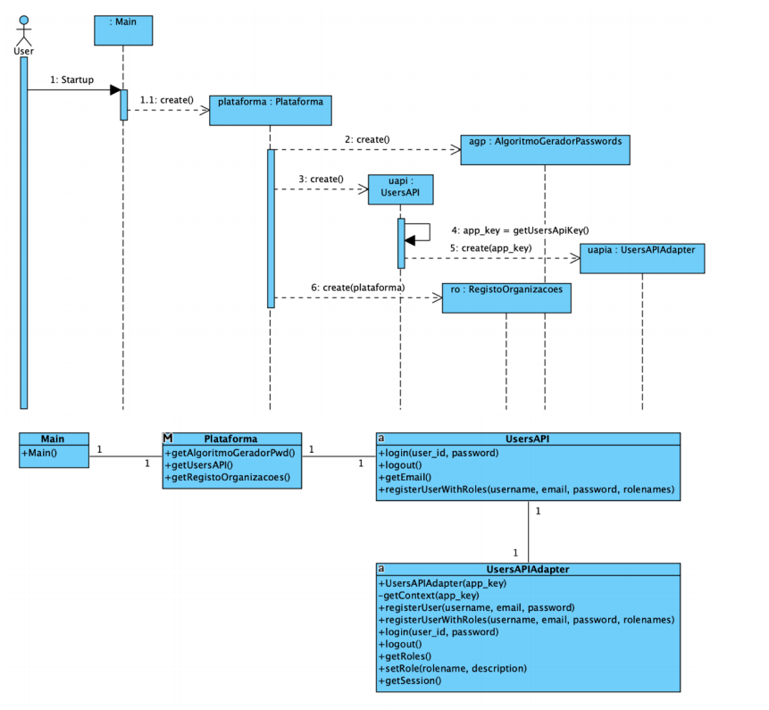
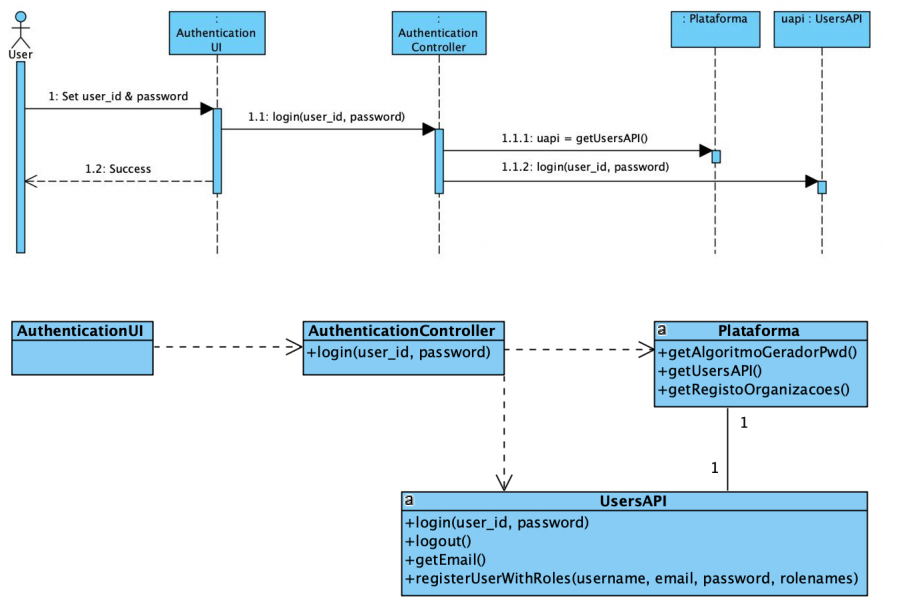

# Documentação comum

*Aqui apresentamos a documentação comum aos casos de uso, designamente no que toca aos diagramas de sequência e de classes do sistema de login, bem como de criação da password. Tudo levando em conta a interação que a nossa aplicação tem com uma API externa.*

**Diagramas de sequência e de classes da API externa**
* Esta API serve para a criação de uma chave para se registar um utilizador num determinado papel e obter uma password

     

**Diagramas de sequência e de classes dos Login dos utilizadores**
* Aqui apresentam-se os diagramas referidos relativamente à autenticação efetuada por cada utilizador

     

