# Especificação suplementar 

## Funcionalidades

*Especifica as funcionalidades que não se relacionam com os casos de
uso, nomeadamente: Auditoria, Reporte e Segurança.*

 * **Auditoria:** a plataforma deve permitir o rastreio de toda a informação gerada e manipulada.

 * **Segurança:** os diversos utilizadores do sistema (Gestor de Organização, Colaborador de Organização, Administrativo, Freelancer) devem estar autenticados no sistema.

 * **Persistência de dados:** assegurada através da serialização dos objetos criados para persistência da informação criada nos múltiplos "runs" do projeto.
 
## Usabilidade

*Avalia a interface com o utilizador. Possui diversas subcategorias,
entre elas: prevenção de erros; estética e design; ajudas e
documentação; consistência e padrões.*

* **Em	termos	visuais,	a	interface	gráfica	da	aplicação deve	assentar	numa	paleta	de
cores	estruturada	em	duas	cores	(primária	e	secundária)	e	esta	ser	configurável
aquando	 da	 sua	 implantação.**

*Seguidamente apresenta-se brevemente a User Interface do nosso projeto.*

* A aplicação começa pela imagem em baixo colocada, permitindo ao utilizador autenticar-se no sistema (para executar diversas funcionalidades, como adicionar áreas de atividade, competências técnicas, ou categorias de tarefa, no caso de usar as credenciais de administrador), ou dá a possibilidade ao utilizador não registado de registar uma organização e o seu gestor:

    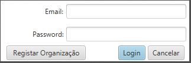 

* Caso o utilizar escolha registar uma organização, a UI abrirá a janela seguinte:

    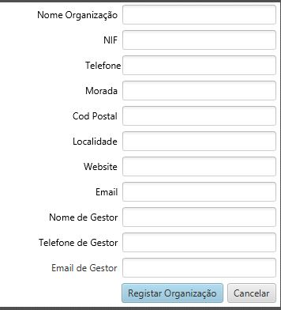 

* Na eventualidade do utilizador fazer login enquanto administrador, abrirá a página em que poderá visualizar as áreas de atividade entretanto criadas, dando-lhe a hipótese de adicionar outra, ou de criar competências técnicas, ou novas categorias de tarefa. Note-se que, em cima, poderá visualizar as "tabs" que tem disponíveis para navegar (nas imagens esta "tab" só estará visível na seguinte imagem, mas ao correr a aplicação poderá er visualizada sempre, independentemente da "tab" em que o utilizador esteja), consoante aquilo que queira fazer:

    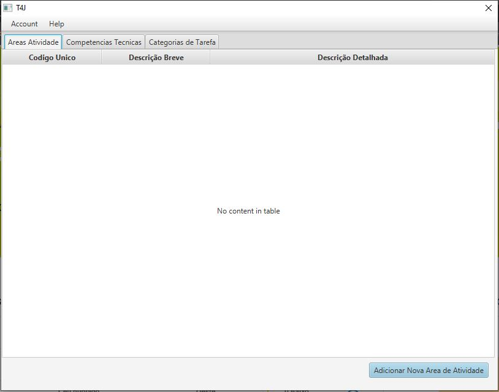 

* Caso o administrador queira adicionar uma nova área de atividade deparar-se-á com a seguinte UI:

    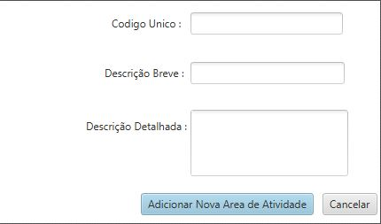 

* O administrador pode, ainda, escolhendo o separador "Competências Técnicas", visualizar as já existentes, ou adicionar uma nova, consoante se pode verificar nas duas imagens seguintes, respetivamente:

    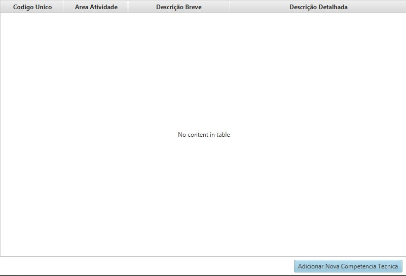 

    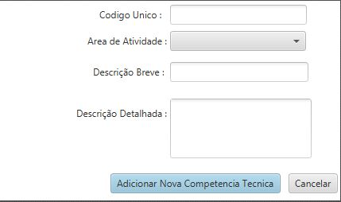 

* Por fim, o administrador pode ver as Categorias de Tarefa já existentes, assim como a informação relevante de cada uma, assim como adicionar novas, conforme se pode ver nas imagens seguintes:

    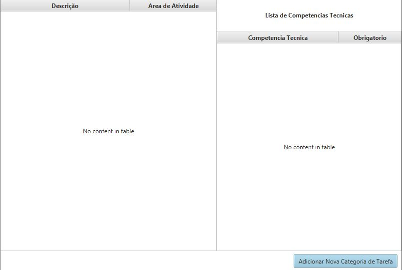 

    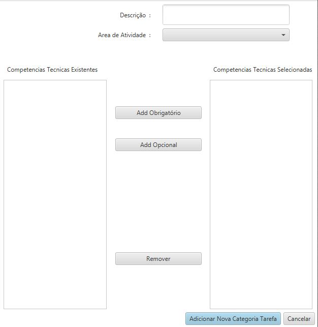 

* Caso a autenticação seja feita pelo Gestor (algo só possível depois de ser criada uma organização e respetivo gestor), este pode interagir com o sistema visualizando os colaboradores (que não o próprio) já afetos à sua organização, bem como a adição de novos, conforme se pode verificar nas imagens seguintes:

    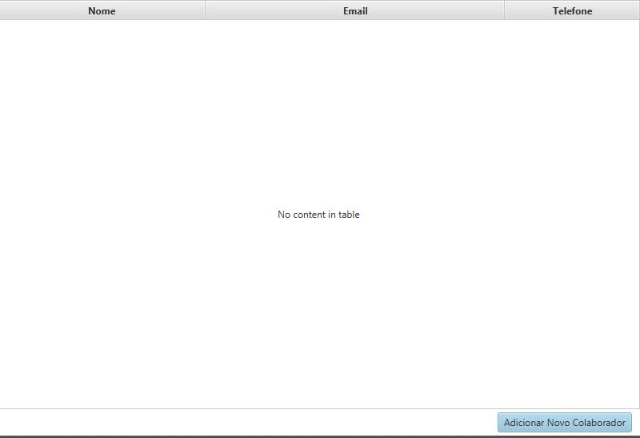 

    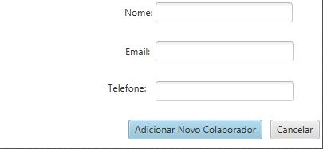 

* Por fim, depois da inserção de um colaborador no sistema, este poderá visualizar as tarefas existentes no sistema afetas à sua organização e proceder, caso assim o queira, à especificação de novas tarefas, algo que pode ser verificado nas imagens seguintes:

    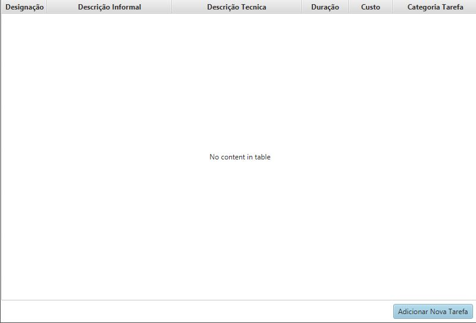 

    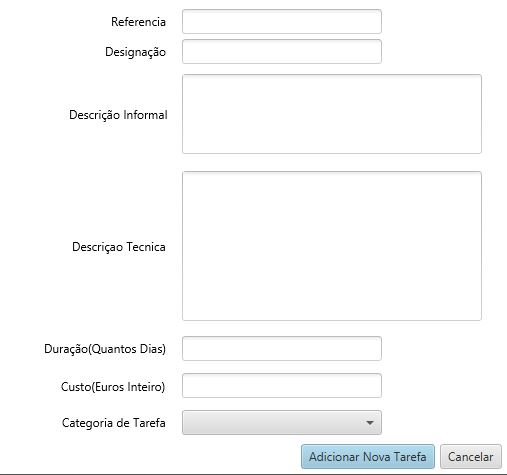 

## Fiabilidade/Confiabilidade
*Refere-se a integridade, conformidade e interoperabilidade do software. Os requisitos a serem considerados são: frequência e gravidade de falha, possibilidade de recuperação, possibilidade de previsão, exatidão, tempo médio entre falhas.*

 * A	 equipa	 de	 desenvolvimento	 deve	 ainda
 especificar	 um	 conjunto	 relevante de	 testes	 de	 cobertura	 e	 mutação	 (e.g.
 unitários,	 funcionais	 e	 de	 integração) que	 assegure	 a	 qualidade	 do	 sistema
 desenvolvido.

## Desempenho
*Avalia os requisitos de desempenho do software, nomeadamente: tempo de resposta, consumo de memória, utilização da CPU, capacidade de carga e disponibilidade da aplicação.*

N/A

## Suportabilidade
*Os requisitos de suportabilidade agrupam várias características, como:
testabilidade, adaptabilidade, manutibilidade, compatibilidade,
configurabilidade, instalabilidade, escalabilidade entre outros.*

 * A	 equipa	 de	 desenvolvimento	 deve	 ainda
 especificar	 um	 conjunto	 relevante de	 testes	 de	 cobertura	 e	 mutação	 (e.g.
 unitários,	 funcionais	 e	 de	 integração) que	 assegure	 a	 qualidade	 do	 sistema
 desenvolvido.

## +

### Restrições de design

*Especifica ou restringe o processo de design do sistema. Exemplos podem incluir: linguagens de programação, processo de software, uso de ferramentas de desenvolvimento, biblioteca de classes, etc.*

- **Adotar boas práticas de identificação de requisitos e de análise e design de software OO**

- **Uso de uma API externa para efeitos de gestão de utilizadores**

### Restrições de implementação

*Especifica ou restringe o código ou a construção de um sistema tais
como: padrões obrigatórios, linguagens de implementação, políticas de
integridade de base de dados, limites de recursos, sistema operativo.*

- **Implementar o núcleo principal do software em Java**

- **Adotar normas de codificação reconhecidas**

- **Adotar normas de codificação de forma a rececionar mais e variados tipos de regimento por terceiros.**

### Restrições de interface

*Especifica ou restringe as funcionalidades inerentes à interação do
sistema com outros sistemas externos.*

- **Interagir com o algoritmo concebido externamente para a geração de passwords.**
- **Interação com uma API externa (protocolo REST) para efeitos de gestão de utilizadores.**

### Restrições físicas

*Especifica uma limitação ou requisito físico do hardware utilizado, por
exemplo: material, forma, tamanho ou peso.*

N/A
