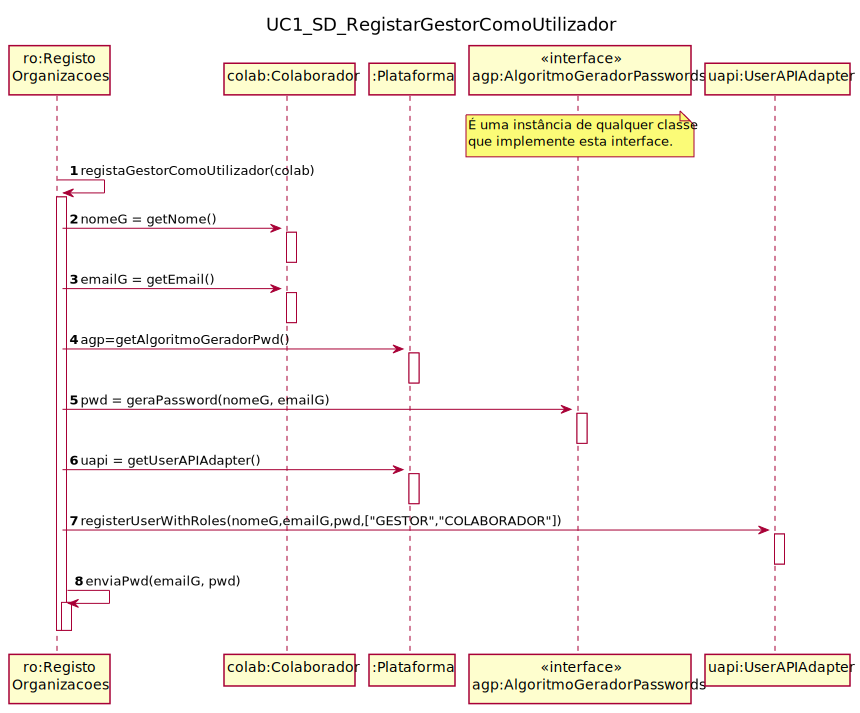

# UC1 - Registar Organização

## 1. Engenharia de Requisitos

### Formato Breve

O utilizador não registado inicia o registo de uma organização. O sistema solicita os dados necessários sobre a organização ( nome da organização, o NIF, o código postal, um contacto telefónico, o endereço web, email) e sobre o colaborador (gestor) que está a proceder ao registo (nome, função, contacto telefónico, email e password). O utilizador não registado introduz os dados solicitados. O sistema valida e apresenta os dados, pedindo que os confirme. O utilizador não registado confirma. O sistema regista os dados da organização e do seu colaborador/gestor, tornando este último um utilizador registado, remetendo-lhe a sua palavra-passe (gerada pelo sistema) por email e informa o utilizador não registado do sucesso da operação.

### SSD

### Formato Completo

#### Ator principal

Administrativo

#### Partes interessadas e seus interesses
* **Utilizador não registado:** pretende regista a organização a que pertence para que possa usufruir das funcionalidade disponibilizadas pela plataforma.
* **T4J:** pretende que a organização em causa se registe de modo usar a plataforma.

#### Pré-condições
* n/a

#### Pós-condições
* A organização é registada no sistema juntamente com o seu gestor.
* Foi criada uma password para acesso ao sistema e respetivas permissões.

### Cenário de sucesso principal (ou fluxo básico)

1. O utilizador não registado começa o processo de registo de uma organização.
2. O sistema solicita os dados requeridos sobre a mesma (nome da organização, NIF, código postal, um contacto telefónico, website, email) e sobre o colaborador (isto é, o gestor) que está a executar o processo de registo (nome, função na empresa, telefone, email e password).
3. O utilizador não registado insere os dados.
4. O sistema valida a introdução, apresenta os dados e solicita a confirmação.
5. O utilizador não registado confirma.
6. O sistema regista os dados da organização e do seu colaborador/gestor, tornando este último um utilizador registado, informando o utilizador não registado do sucesso da operação.

#### Extensões (ou fluxos alternativos)

*a. O utilizador não registado solicita o cancelamento da especificação da competência técnica.  
> O caso de uso termina.

4a. Dados de código postal incompletos.  
>1. O sistema indica os dados incompletos.
>2. O sistema solicita a introdução da informação incompleta (fluxo 3).
> 2a. O utilizador não registado não introduz quaisquer dados. O UC termina.

4b. Dados mínimos não facultativos não introduzidos.
>	1. O sistema indica os dados em falta
>	2. O sistema solicita a introdução dos dados em falta (fluxo 3).  
> 2a. O utilizador não registado não completa os dados. UC termina..

4c. O sistema indica que algum dado introduzido que deva ser único já existe no sistema.
> 1. O sistema alerta o utilizador não registado sobre isso.
> 2. O sistema permite a sua alteração (fluxo 3)
> 2a. O utilizador não registado não altera os dados. O UC termina

#### Requisitos especiais
\-

#### Lista de Variações de Tecnologias e Dados
\-

#### Frequência de Ocorrência
\-

#### Questões em aberto

* Existem outros dados que são necessários?
* Quais as regras relativamente à password?
* É possível fazer reset à password posteriormente?

## 2. Análise OO

### Excerto do Modelo de Domínio Relevante para o UC

## 3. Design - Realização do Caso de Uso

###	Diagrama de Sequência

###	Diagrama de Classes

