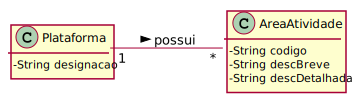

# UC2 - Definir Área de Atividade

## 1. Engenharia de Requisitos

### Formato Breve

O administrativo inicia a definição de uma nova área de atividade. O sistema solicita os dados necessários (i.e. código único e descrição breve e detalhada). O administrativo introduz os dados solicitados. O sistema valida e apresenta os dados ao administrativo, pedindo que os confirme. O administrativo confirma. O sistema regista os dados e informa o administrativo do sucesso da operação.

### SSD

### Formato Completo

#### Ator principal

Administrativo

#### Partes interessadas e seus interesses
* **Administrativo:** pretende definir as áreas de atividade para que, a posteriori, sejam elementos agregadores de categorias de tarefa.
* **T4J:** pretende que a plataforma permita associar competências técnicas e categorias de tarefa às áreas de atividade devidas.

#### Pré-condições
Administrativo autenticado no sistema.

#### Pós-condições
A informação da área de atividade é registada no sistema para posterior uso.

### Cenário de sucesso principal (ou fluxo básico)

1. O administrativo inicia a definição de uma nova área de atividade. 
2. O sistema solicita os dados necessários (i.e. código único, descrição breve e detalhada). 
3. O administrativo introduz os dados solicitados. 
4. O sistema valida e apresenta os dados ao administrativo, pedindo que os confirme. 
5. O administrativo confirma. 
6. O sistema regista os dados e informa o administrativo do sucesso da operação.

#### Extensões (ou fluxos alternativos)

*a. O administrativo quer cancelar a definição da área de atividade.

> O caso de uso termina.

4a. Dados mínimos obrigatórios em falta.
>	1. O sistema informa quais os dados em falta.
>	2. O sistema permite a introdução dos dados em falta (passo 3)
>
	>	2a. O administrativo não altera os dados. O caso de uso termina.

4b. O sistema deteta que os dados introduzidos devem ser únicos (já existem no sistema).
>	1. O sistema alerta o administrativo.
>	2. O sistema permite a sua alteração (passo 3)
>
	>	2a. O administrativo não altera os dados. O caso de uso termina.

4c. O sistema deteta que os dados introduzidos são inválidos.
> 1. O sistema alerta o administrativo. 
> 2. O sistema permite a sua alteração (passo 3).
> 
	> 2a. O administrativo não altera os dados. O caso de uso termina. 

#### Questões em aberto

* Existem outros dados que são necessários?
* Todos os dados são obrigatórios?
* O código único é introduzido pelo administrativo, ou o sistema gera-o automaticamente?
* É possível alterar, ou remover, áreas de atividade?
* Há algum limite para a quantidade de áreas de atividade?
* Qual a frequência de ocorrência deste caso de uso?

## 2. Análise OO

### Excerto do Modelo de Domínio Relevante para o UC

## 3. Design - Realização do Caso de Uso

###	Diagrama de Sequência

###	Diagrama de Classes

