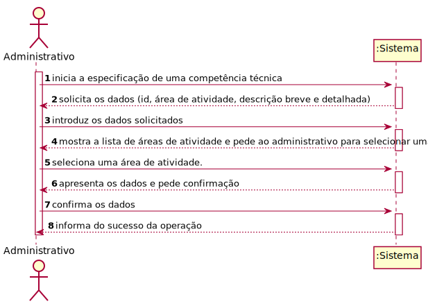
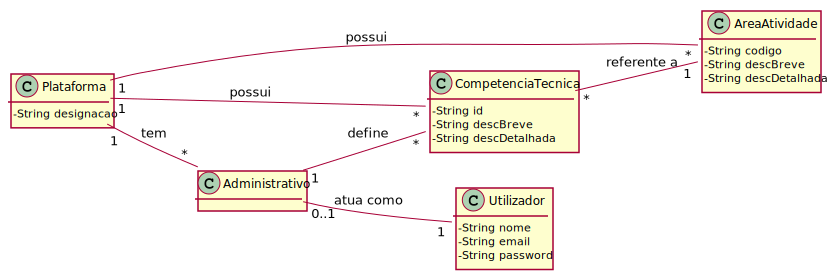
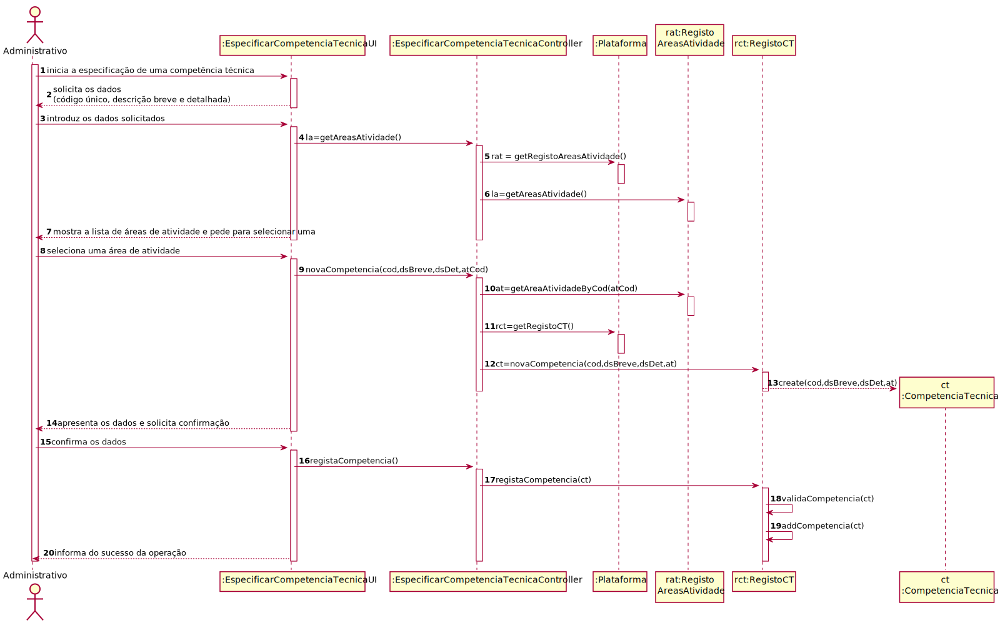
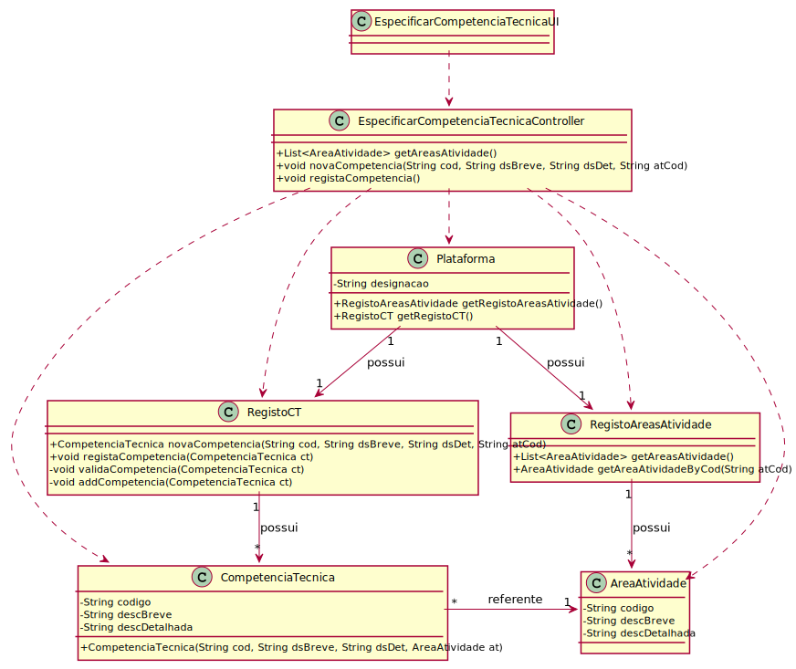

# UC4 - Registar Competência Técnica

## 1. Engenharia de Requisitos

### Formato Breve

O administrativo inicio registo de uma competência técnica. O sistema solicita os dados necessários (id, área de atividade e descrição breve e detalhada). O administrativo introduz os dados solicitados. O sistema mostra a lista de áreas de atividade e pede ao administrativo para selecionar uma. O administrador seleciona uma área de atividade. O sistema valida e apresenta os dados ao administrativo, pedindo que os confirme. O administrativo confirma os dados. O sistema regista os dados e informa o administrativo do sucesso da operação.

### SSD

### Formato Completo

#### Ator principal

Administrativo

#### Partes interessadas e seus interesses
* **Administrativo:** pretende especificar as competências técnicas requeridas para a realização de tarefas.
* **Freelancer:** pretende conhecer as competências técnicas que podem ser requeridas para a realização de tarefas.
* **Organização:** pretende contratar pessoas com as competências técnicas requeridas para a realização de tarefas.
* **T4J:** pretende que as competências técnicas estejam descritas com rigor/detalhe.

#### Pré-condições
* Organização, gestor e áreas de atividade já criados.
* Administrativo já criado.

#### Pós-condições
A informação da nova competência técnica é registada no sistema.

### Cenário de sucesso principal (ou fluxo básico)

1. O administrativo inicia o registo de uma competência técnica.
2. O sistema solicita os dados necessários (id, descrição breve e detalhada).
3. O administrativo introduz os dados solicitados.
4. O sistema mostra a lista de áreas de atividade e pede ao administrativo para selecionar uma.
5. O administrador seleciona uma área de atividade.
6. O sistema valida e apresenta os dados ao administrativo, pedindo que os confirme.
7. O administrativo confirma os dados.
8. O sistema regista os dados e informa o administrativo do sucesso da operação.

#### Extensões (ou fluxos alternativos)

*a. O administrativo solicita o cancelamento do registo da competência técnica.  
> O caso de uso termina.

4a. Não existem áreas de atividade definidas no sistema.  
>1. O sistema informa o administrativo de tal facto.  
>2. O sistema permite a criação de uma nova área de atividade (UC2).  
> 2a. O administrativo não cria uma área de atividade. O caso de uso termina.

6a. Dados mínimos obrigatórios em falta.
>	1. O sistema informa quais os dados em falta.
>	2. O sistema permite a introdução dos dados em falta (passo 3).  
> 2a. O administrativo não introduz os dados em falta. O caso de uso termina.

6b. O sistema deteta que os dados (ou algum subconjunto dos dados) introduzidos devem ser únicos e que já existem no sistema.
>	1. O sistema alerta o administrativo para o facto.
>	2. O sistema permite a sua alteração (passo 3).  
> 2a. O administrativo não altera os dados. O caso de uso termina.

6c. O sistema deteta que os dados introduzidos (ou algum subconjunto dos dados) são inválidos.
> 1. O sistema alerta o administrativo para o facto.
> 2. O sistema permite a sua alteração (passo 3)..  
> 2a. O administrativo não altera os dados. O caso de uso termina.

#### Questões em aberto

* Existem outros dados que são necessários?
* Todos os dados são obrigatórios?
* Existem requisitos especiais para este caso de uso?
* Qual a frequência de ocorrência deste caso de uso?
* O código único da competência técnica é introduzido pelo ator, ou é incrementado automaticamente pelo sistema?

## 2. Análise OO

### Excerto do Modelo de Domínio Relevante para o UC

## 3. Design - Realização do Caso de Uso

###	Diagrama de Sequência

###	Diagrama de Classes

