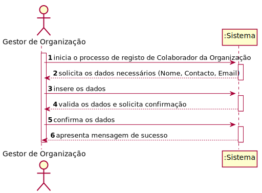
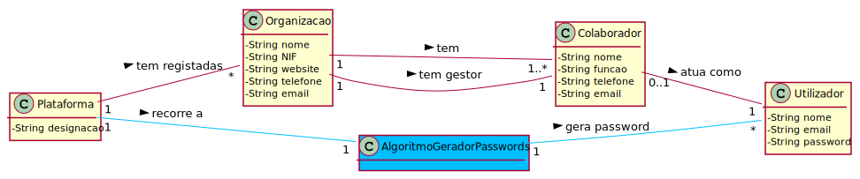
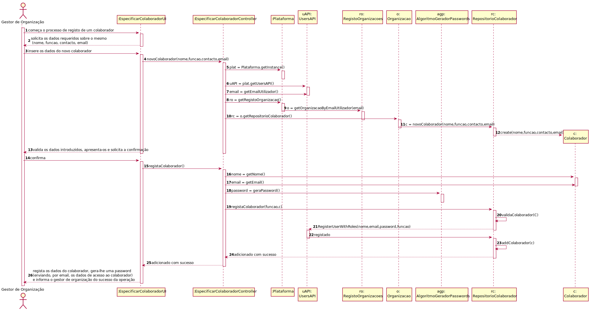
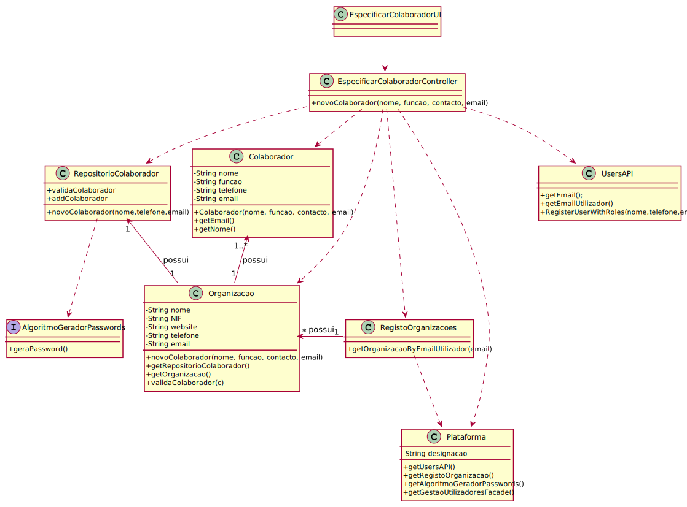

# UC5 - Especificar Colaborador

## 1. Engenharia de Requisitos

### Formato Breve

O Gestor de Organização inicia o processo de registo de um Colaborador da Organização. O sistema solicita os dados necessários (Nome, Função, Contacto, Email). O Gestor insere os dados e o sistema valida-os e apresenta solicitando confirmação do Gestor de Organização. O Gestor confirma.  O sistema regista os dados do colaborador, gera-lhe uma password (enviando, por email, os dados de acesso ao colaborador) e informa o gestor de organização do sucesso da operação.

### SSD

### Formato Completo

#### Ator principal

Gestor de Organização

#### Partes interessadas e seus interesses
* **Gestor de Organização:** quer especificar colaboradores que integrarão a sua organização e que poderão especificar e publicar tarefas da mesma.
* **Colaborador da Organização:** quer ter acesso à plataforma com permissão de especificar, publicar e adjudicar tarefas para facilitar o outsourcing destas.
* **Organização:** quer que os seus colaboradores realizem o outsourcing de tarefas.
* **T4J:** pretende que a plataforma permita às organizações ter múltiplos colaboradores registados.

#### Pré-condições
* Organização e Gestor de Organização estão registados no sistema.
* O algoritmo gerador de passwords está bem implementado.
* O sistema está preparado para enviar o email com os dados de acesso.

#### Pós-condições
* Colaborador da Organização registado no sistema.

### Cenário de sucesso principal (ou fluxo básico)

1. O Gestor de Organização começa o processo de registo de um Colaborador da Organização. 
2. O sistema solicita os dados requeridos sobre o mesmo (Nome, Função, Contacto, Email). 
3. O Gestor de Organização insere os dados do novo colaborador da Organização.
4. O sistema valida os dados introduzidos, apresenta-os e solicita a confirmação ao Gestor.
5. O Gestor confirma. 
6. O sistema regista os dados do colaborador, gera-lhe uma password (enviando, por email, os dados de acesso ao colaborador) e informa o gestor de organização do sucesso da operação.

#### Extensões (ou fluxos alternativos)

*a. O gestor de organização solicita o cancelamento da especificação de um colaborador da sua organização.

> O caso de uso termina.

4a. Dados mínimos obrigatórios em falta.
>	1. O sistema informa quais os dados.
>	2. O sistema permite a introdução dos dados em falta (passo 3)
>
	>	2a. O gestor de organização não altera os dados. O caso de uso termina.

4b. O sistema deteta que os dados introduzidos devem ser únicos e que já existem no sistema.
>	1. O sistema alerta o gestor de organização.
>	2. O sistema permite a sua alteração (passo 3)
>
	>	2a. O gestor de organização não altera os dados. O caso de uso termina.

4c. O sistema deteta que o email introduzido deve ser único e que já existe no sistema.
>
>1. O sistema alerta o gestor de organização.
>
> 2. O sistema permite a sua alteração (passo 3).
>
>>2a. O gestor de organização não altera os dados. O caso de uso termina.

6a. O sistema deteta que o email não foi enviado ao colaborador.
> 1. O sistema alerta o gestor de organização.

>2. O sistema permite a alteração do email.
>> 2a. O gestor de organização não altera o email. O caso de uso termina.

#### Requisitos especiais

* A password deve ser gerada pela plataforma recorrendo a um algoritmo externo.

#### Lista de Variações de Tecnologias e Dados
\-

#### Frequência de Ocorrência
\-

#### Questões em aberto

* Qual a frequência de ocorrência deste caso de uso?
* Que dados do colaborador devem ser únicos (nome, email, contacto)?

## 2. Análise OO

### Excerto do Modelo de Domínio Relevante para o UC

## 3. Design - Realização do Caso de Uso

###	Diagrama de Sequência

###	Diagrama de Classes

