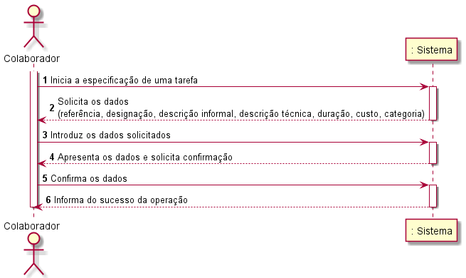
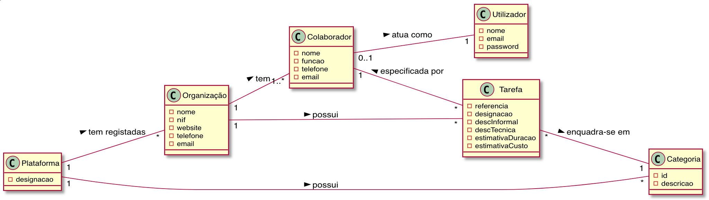
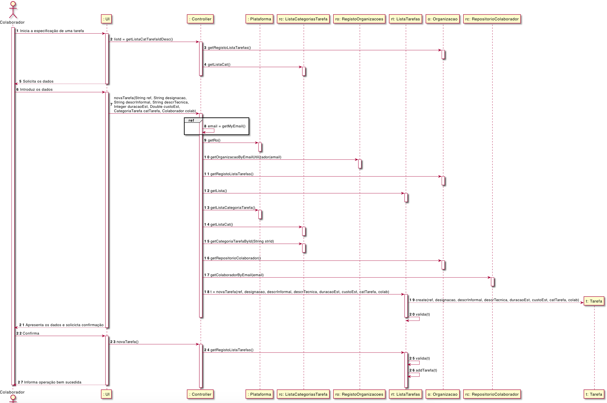
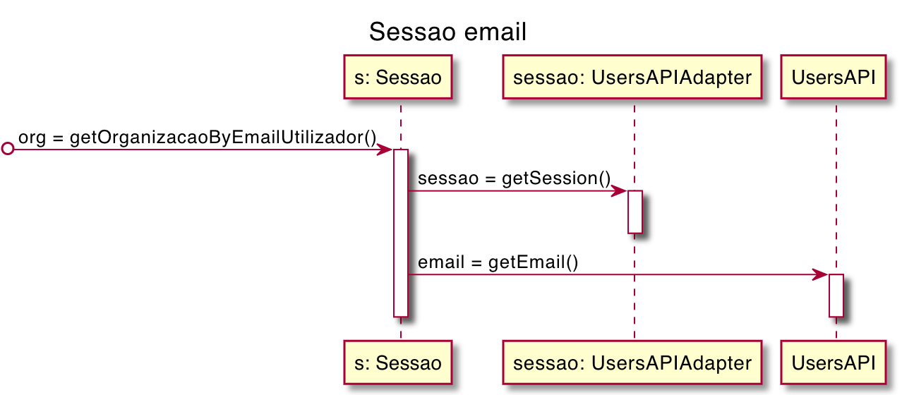
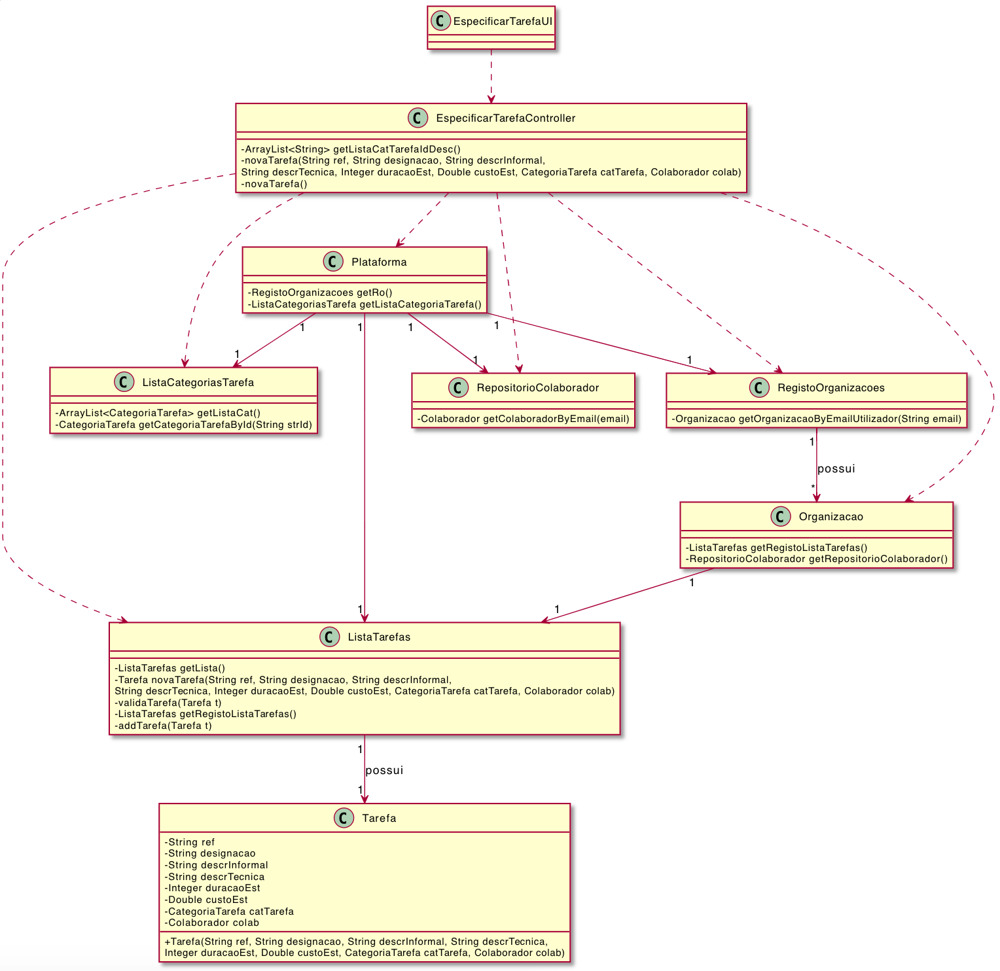

# UC6 - Especificar Tarefa

## 1. Engenharia de Requisitos

### Formato Breve

O colaborador da organização inicia a especificação de uma tarefa. O sistema solicita os dados necessários (i.e. uma referência única por organização, uma designação, uma descrição informal e outra de carácter técnico, uma estimativa de duração e custo, a categoria). O colaborador de organização introduz os dados solicitados. O sistema valida e apresenta os dados ao colaborador de organização, pedindo que os confirme. O colaborador de organzação confirma. O sistema regista os dados e informa o colaborador de organização do sucesso da operação.

### SSD

### Formato Completo

#### Ator principal

Colaborador

#### Partes interessadas e seus interesses
* **Colaborador:** quer criar uma tarefa.
* **Organização:** quer a existência de tarefas para posteriormente serem publicadas.
* **T4J:** modelo de negócio da plataforma.

#### Pré-condições
* Ter uma categoria de tarefa na qual se vai enquadrar.

#### Pós-condições
 Uma nova Tarefa é registada no sistema.

### Cenário de sucesso principal (ou fluxo básico)

1. O colaborador da organização começa o processo de especificar a tarefa.
2. O sistema solicita os dados (referência, designação, descrição informal, descrição técnica, duração, custo, categoria).
3. O colaborador insere os dados.
4. O sistema apresenta os dados e solicita confirmação.
5. O colaborador confirma os dados.
6. O sistema informa do sucesso da operação.

#### Extensões (ou fluxos alternativos)

*a. O colaborador pede o cancelamento da especificação da tarefa.  
> O caso de uso termina.

4a. Não existem categorias de tarefa no sistema (ainda não foram introduzidas).  
>   1. O sistema informa o colaborador do problema.   
>       1a. O caso de uso termina.

6a. O sistema indica que há dados obrigatórios omissos.
>	1. O sistema alerta o colaborador, informando-o dos dados que estão omissos.
>	2. O sistema permite que o colaborador os introduza (fluxo 2).
>       2a. O colaborador não o faz. O caso de uso termina.

#### Requisitos especiais
\-

#### Tecnologia e Lista de Variações de Dados
\-

#### Frequência de Ocorrência
\- Pode ser quase contínuo

#### Questões em aberto

* Existem outros dados que são necessários?
* Existem requisitos especiais para este caso de uso?
* Existe variação de valor monetário do POT?

## 2. Análise OO

### Excerto do Modelo de Domínio Relevante para o UC

## 3. Design - Realização do Caso de Uso

###	Diagrama de Sequência

###	Diagrama de Classes

